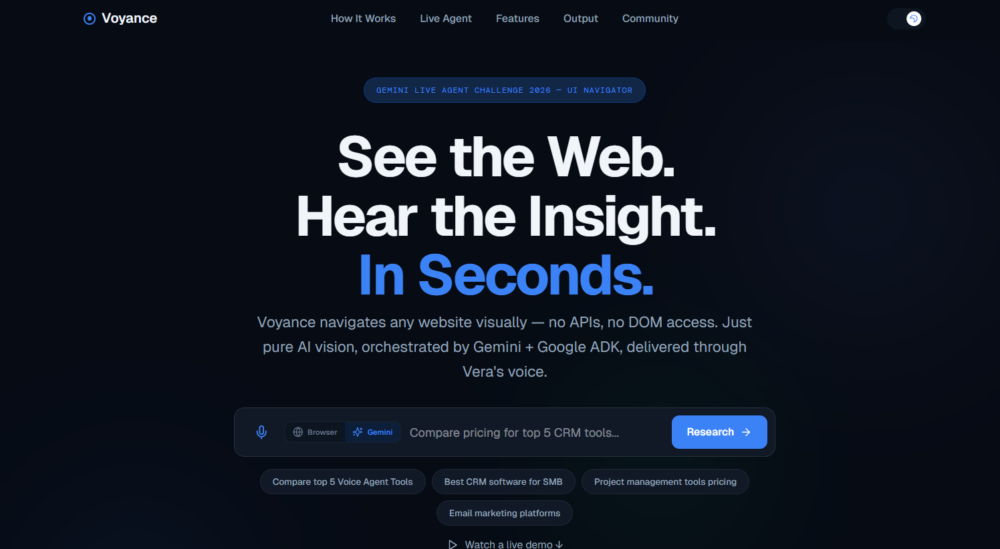
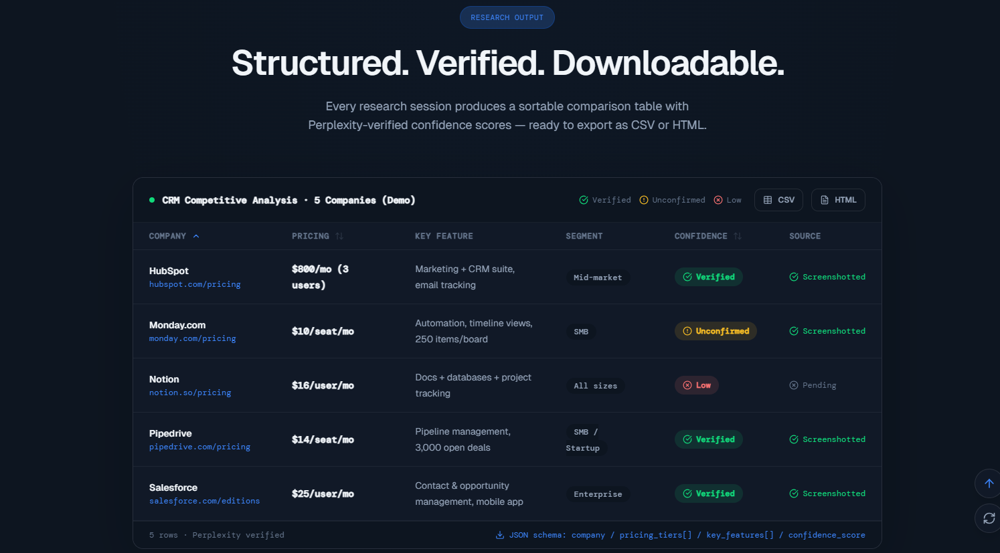
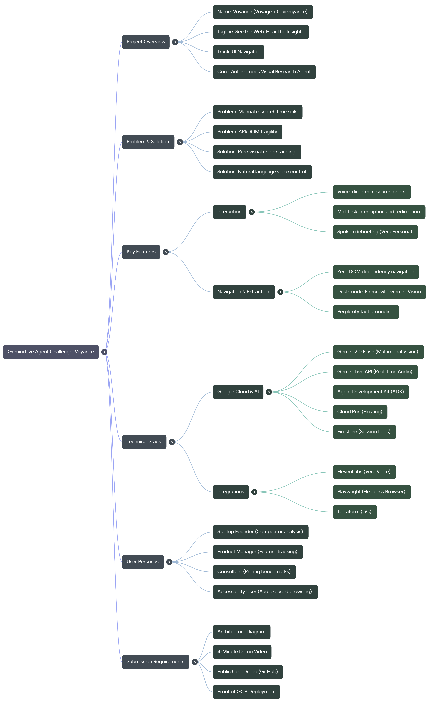

# Voyance

**AI-powered visual web research agent** — speak a task, watch it navigate live sites with Gemini vision, get a spoken briefing and a comparison report.

[](https://geminiliveagentchallenge.devpost.com/)  
**Track:** [UI Navigator](https://geminiliveagentchallenge.devpost.com/) · Visual UI understanding & interaction

---

## Table of contents

- [Voyance](#voyance)
  - [Table of contents](#table-of-contents)
  - [What it does](#what-it-does)
    - [Features](#features)
    - [Screenshots](#screenshots)
    - [Hackathon alignment](#hackathon-alignment)
  - [Quick start](#quick-start)
    - [Prerequisites](#prerequisites)
    - [1. Clone and install](#1-clone-and-install)
    - [2. Backend](#2-backend)
    - [3. Frontend](#3-frontend)
    - [4. Run a research task](#4-run-a-research-task)
  - [Tech stack](#tech-stack)
  - [Architecture](#architecture)
  - [Voyance mind map](#voyance-mind-map)
  - [Environment variables](#environment-variables)
  - [Deployment](#deployment)
  - [Project structure](#project-structure)
  - [Community & write-ups](#community--write-ups)
  - [Contact](#contact)
  - [License](#license)

---

## What it does

Voyance turns **natural language** into **competitive intelligence** in minutes:

| Step | Description |
| ---- | ----------- |
| **1. You say** | What you need — e.g. *"Compare pricing for the top 5 CRM tools"* |
| **2. The agent** | Plans, visits 3–5 live websites, and “reads” pages with **Gemini multimodal vision** (screenshots only — no DOM scraping) |
| **3. You get** | A sortable comparison table, CSV/HTML export, and **Vera** (ElevenLabs) reading the briefing aloud |

No DOM hacks, no site-specific APIs. Works on any site, through redesigns. Backend runs on **Google Cloud Run**.

### Features

- **Natural language input** — Describe your research task in plain English (e.g. compare pricing, features, or reviews).
- **Multi-site research** — Agent visits 3–5 live websites per task with no DOM scraping or site-specific APIs.
- **Gemini vision** — Screenshot-based page understanding; works across redesigns and any site.
- **Comparison table** — Sortable results with company, segment, pricing, and key details.
- **Export** — Download results as CSV or HTML.
- **Spoken briefing (Vera)** — ElevenLabs TTS reads the summary aloud.
- **Fact verification** — Perplexity-backed claim checks where relevant.

### Screenshots

**Hero** — Enter your research query and start the agent.



**Output** — Comparison table, CSV/HTML export, and *Listen to Vera*.



### Hackathon alignment

| Requirement | Voyance |
| ----------- | ------- |
| **Gemini model** | Gemini 2.0 Flash (planning, screenshot analysis, synthesis) |
| **Google GenAI SDK / ADK** | **Google GenAI SDK** (`google-generativeai`): Gemini for planning, vision, synthesis. Custom agent loop (plan → navigate → extract → verify), not the ADK library. |
| **Google Cloud service** | Backend on **Google Cloud Run** |
| **UI Navigator** | Screenshots analyzed by Gemini vision; agent outputs navigation and extraction actions |

*Third-party: ElevenLabs (Vera TTS), Firecrawl (extraction), Perplexity (fact verification).*

---

## Quick start

### Prerequisites

- **Node.js** 18+
- **Python** 3.10+
- **API keys:** [Google AI Studio](https://aistudio.google.com/) (Gemini), [ElevenLabs](https://elevenlabs.io/), [Firecrawl](https://firecrawl.dev/), [Perplexity](https://www.perplexity.ai/) — see `backend/.env.example`

### 1. Clone and install

```bash
git clone https://github.com/ibtisamafzal/voyance.git
cd voyance
npm install
```

### 2. Backend

```bash
cd backend
pip install -r requirements.txt
playwright install chromium
cp .env.example .env
# Edit .env with your API keys
uvicorn main:app --host 0.0.0.0 --port 8000 --reload
```

| Service | URL |
| ------- | --- |
| Backend | <http://localhost:8000> |
| API docs | <http://localhost:8000/api/docs> |

### 3. Frontend

From the **repo root** (new terminal):

```bash
npm run dev
```

Frontend: **<http://localhost:5173>**

### 4. Run a research task

1. Enter a query in the hero (e.g. *"Compare pricing for top 5 CRM tools"*).
2. Click **Research** — the agent plans, navigates, extracts, and verifies.
3. In the Output section: sort the table, export **CSV** or **HTML**, and click **Listen to Vera** for the spoken briefing.

---

## Tech stack

| Layer | Technology |
| ----- | ---------- |
| **AI & vision** | Gemini 2.0 Flash |
| **Browser** | Playwright (headless Chromium), screenshot-based only |
| **Extraction** | Firecrawl API → Gemini vision fallback |
| **Verification** | Perplexity API |
| **Voice** | ElevenLabs TTS (Vera) |
| **Backend** | FastAPI, WebSockets; **Google Cloud Run** |
| **Frontend** | React, Vite, Tailwind |
| **Infra** | Docker, Cloud Build, Terraform (`infra/`) |

---

## Architecture

User and frontend → backend on Google Cloud Run → Gemini, Playwright, Firecrawl, Perplexity, ElevenLabs.


---

## Voyance mind map

> **From idea to implementation at a glance.**
>
> This mind map captures the core of Voyance for the Gemini Live Agent Challenge — from the problem and solution, through key features and technical stack, to user personas and submission requirements.

<p align="center">
  
</p>

---

## Environment variables

Copy `backend/.env.example` to `backend/.env` and set:

| Variable | Purpose |
| -------- | ------- |
| `GEMINI_API_KEY` | Google AI Studio |
| `ELEVENLABS_API_KEY` | Vera TTS |
| `FIRECRAWL_API_KEY` | Fast extraction |
| `PERPLEXITY_API_KEY` | Fact verification |
| `GOOGLE_CLOUD_PROJECT` | Optional (Firestore); in-memory fallback if unset |

---

## Deployment

- **Backend:** Google Cloud Run. Deploy with `infra/cloudbuild.yaml` from repo root:

  ```bash
  gcloud builds submit --config=infra/cloudbuild.yaml .
  ```

  Default: 1 GiB memory, 1 CPU (increase to 2 GiB if needed for Playwright).
- **Frontend:** Host on Vercel or any static host; set `VITE_API_URL` to your Cloud Run URL (no trailing slash).

**Troubleshooting:** Stuck on "Connecting…" → set `VITE_API_URL` on your host. WebSocket 403 → ensure no trailing slash in `VITE_API_URL`. OOM → increase memory in `cloudbuild.yaml`.

---

## Project structure

```text
├── src/app/              # React frontend
│   ├── components/       # HeroSection, ResearchOutputSection, Navbar, etc.
│   └── context/          # ResearchContext (shared state)
├── backend/              # FastAPI backend
│   ├── app/
│   │   ├── agent.py      # Research loop (plan → navigate → extract → verify)
│   │   ├── routers/      # Research, voice, health, sessions
│   │   └── services/     # Gemini, Firecrawl, Perplexity, Playwright, ElevenLabs
│   └── main.py
└── infra/                # GCP automation
    ├── cloudbuild.yaml   # Build & deploy to Cloud Run
    └── main.tf           # Terraform
```

---

## Community & write-ups

- **Deep-dive blog**: [How We Built Voyance (DEV.to)](https://dev.to/ibtisamafzal/how-we-built-voyance-an-ai-agent-that-researches-the-web-by-seeing-it-214h)
- **Reddit build log**: [How we built Voyance — an AI agent that researches the web by “seeing” it](https://www.reddit.com/user/IbtisamAfzal/comments/1rhtivl/how_we_built_voyance_an_ai_agent_that_researches/?utm_source=share&utm_medium=web3x&utm_name=web3xcss&utm_term=1&utm_content=share_button)
- **Hackathon submission**: [Gemini Live Agent Challenge — UI Navigator track](https://geminiliveagentchallenge.devpost.com/)
- **Source code**: [Voyance on GitHub](https://github.com/ibtisamafzal/voyance)

---

## Contact

| | |
| --- | --- |
| **Email** | [chaudhryibtisam2003@gmail.com](mailto:chaudhryibtisam2003@gmail.com) |
| **LinkedIn** | [linkedin.com/in/ibtisamafzal](https://linkedin.com/in/ibtisamafzal/) |

**Blog:** [How We Built Voyance (DEV)](https://dev.to/ibtisamafzal/how-we-built-voyance-an-ai-agent-that-researches-the-web-by-seeing-it-214h) · **Hackathon:** [Gemini Live Agent Challenge](https://geminiliveagentchallenge.devpost.com/) (Deadline: Mar 16, 2026)

---

## License

MIT
